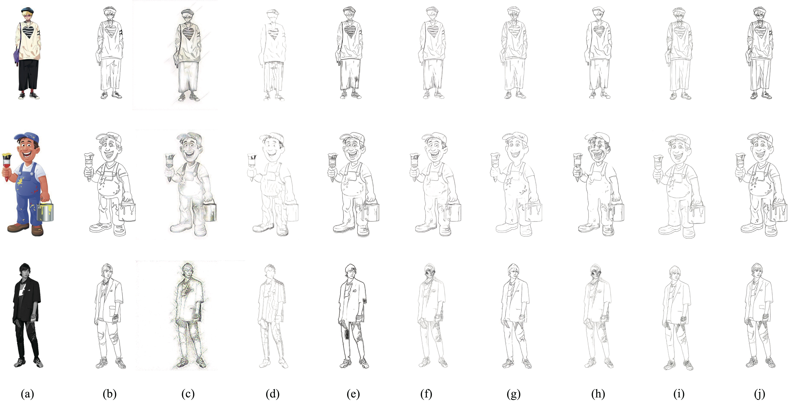

# P2LDGAN
- This repository is the code for "Learning to Generate Artistic Character Line Drawing".
- We will make our full code and dataset available once the job has been accepted.

## Pre-trained Models
You can download our trained and trained models using P2LDGAN and our constructed line-drawing dataset via [Google Drive](https://drive.google.com/file/d/1To4V_Btc3QhCLBWZ0PdSNgC1cbm3isHP/view?usp=sharing)

## Sample Results
(a) Input photo/image; (b) Ground truth; (c) Gatys; (d) CycleGAN; (e) DiscoGAN; (f) UNIT; (g) pix2pix; (h) MUNIT; (i) Our baseline; (j) Our P2LDGAN.

